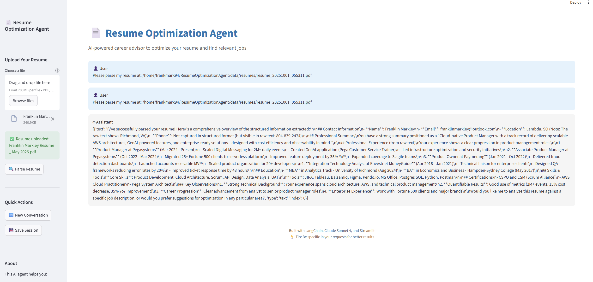

# Resume Optimization Agent 📄

<div align="center">
  

  **AI-powered career advisor to optimize your resume and find relevant jobs**

  [](https://www.python.org/downloads/)
  [](https://langchain.com)
  [](https://anthropic.com)
  [](https://streamlit.io)
  [](https://opensource.org/licenses/MIT)
</div>

---

## 🎯 Overview

An AI-powered career advisor that helps job seekers optimize their resumes and find relevant job opportunities through intelligent analysis and personalized recommendations using Claude Sonnet 4 and LangChain.

**Key Features:**
- 🔍 **Resume Parsing** - Extract structured data from PDF, DOCX, and TXT files
- 📊 **Gap Analysis** - Compare resumes against jobs to identify skill gaps
- ✨ **AI Optimization** - Claude Sonnet 4-powered content improvements
- 🎯 **ATS Scoring** - Evaluate and improve Applicant Tracking System compatibility
- 💬 **Context Memory** - Maintains conversation state across multiple interactions
- 🔧 **10 Specialized Tools** - Purpose-built agent tools for resume optimization

---

## 🏗️ System Architecture

<div align="center">
  
</div>

### Architecture Components

The system is built on a **modular, tool-based architecture** with four main layers:

#### 1. **UI Layer (Streamlit Interface)**
- File upload and resume management
- Interactive chat interface
- Real-time session state debugging
- Context-aware user experience

#### 2. **Agent Layer (LangChain + Claude Sonnet 4)**
- **LangChain Agent Orchestrator**: Coordinates tool selection and execution
- **Claude Sonnet 4 API**: Powers intelligent analysis and content generation
- **Memory Storage (SQLite)**: Persists conversation history and context
- **Conversation History**: Maintains multi-turn dialogue context

#### 3. **Tool Layer (10 Specialized Tools)**
- **Resume Parser**: Extracts structured data from documents
- **Job Analyzer**: Analyzes job descriptions and requirements
- **Gap Analyzer**: Compares resumes to job requirements
- **Resume Optimizer**: Rewrites content for better job matches
- **Cover Letter Generator**: Creates personalized cover letters
- **Application Tracker**: Manages job application history

#### 4. **Data Layer**
- **SQLite DB**: Stores applications, resumes, and job data
- **File Storage**: Manages uploaded PDF/DOCX files
- **Vector Store**: Optional ChromaDB for semantic search

---

## 🔄 Data Flow

<div align="center">
  
</div>

### Process Flow Explanation

#### User Layer (TO-DO)
1. **Upload Resume PDF** → Sends file to Agent System
2. **Provides Job Preferences** → Communicates requirements to Agent
3. **Reviews Optimized Resume** → Receives enhanced version (TO-45)

#### Agent System (TO-20)
1. **Parses Resume** → Extracts structured data from PDF
2. **Searches Jobs** → Queries Indeed/LinkedIn for matching positions
3. **Optimizes Content** → Uses Claude API to generate improved version

#### External Services
- **Claude API (LLM Processing)** → Analyzes and generates content
- **File Storage (PDF/DOCX files)** → Stores original and optimized resumes
- **Database (Application Tracking)** → Persists job applications and matches

This **asynchronous workflow** ensures the agent can handle multiple requests efficiently while maintaining context across conversations.

---

## 🚀 Features

### Core Capabilities

#### Resume Management
- ✅ **Multi-format parsing**: PDF, DOCX, TXT support
- ✅ **Structured extraction**: Contact info, skills, experience, education
- ✅ **Version tracking**: Manage multiple resume variants
- ✅ **Session caching**: Instant access to parsed data

#### Job Analysis
- ✅ **Requirement extraction**: Automatically identifies must-have skills
- ✅ **Keyword identification**: Detects ATS-critical terms
- ✅ **Experience level detection**: Matches seniority requirements
- ✅ **Company insights**: Analyzes job descriptions for cultural fit

#### Intelligent Comparison
- ✅ **Gap analysis**: Identifies missing skills and qualifications
- ✅ **Match scoring**: 0-100% compatibility rating
- ✅ **Partial matching**: Recognizes transferable skills
- ✅ **Priority ranking**: Highlights most important gaps

#### Content Optimization
- ✅ **Section rewriting**: Optimizes summaries, bullets, skills
- ✅ **Keyword incorporation**: Naturally integrates ATS keywords
- ✅ **Achievement focus**: Emphasizes quantifiable results
- ✅ **ATS compatibility**: Ensures parsing-friendly formatting

#### Context Memory System 🆕
- ✅ **Resume persistence**: Remembers uploaded files across conversation
- ✅ **Parsed data caching**: Instant retrieval without re-parsing
- ✅ **Session state tracking**: Maintains job search context
- ✅ **Smart tool selection**: Automatically uses cached data when available

---

## 🛠️ Technical Stack

| Component | Technology | Purpose |
|-----------|-----------|---------|
| **LLM** | Claude Sonnet 4 | AI analysis and generation |
| **Agent Framework** | LangChain | Tool orchestration |
| **UI** | Streamlit | Interactive web interface |
| **Database** | SQLite + SQLAlchemy | Data persistence |
| **Validation** | Pydantic | Data modeling |
| **Document Parsing** | PyPDF2, python-docx | Resume extraction |
| **Session Management** | Custom SessionState | Context tracking |

---

## 📦 Project Structure

```
ResumeOptimizationAgent/
├── 📱 app.py                        # Streamlit UI with session integration
├── ⚙️ config.py                     # Configuration management
├── 📋 requirements.txt              # Python dependencies
├── 🔐 .env.example                  # Environment template
│
├── 🤖 agent/
│   ├── orchestrator.py              # LangChain agent + output parsing
│   └── prompts.py                   # Context-aware system prompts
│
├── 🔧 tools/
│   ├── resume_parser.py             # Resume parsing with caching
│   ├── job_analyzer.py              # Job description analysis
│   ├── resume_comparator.py         # Gap analysis
│   ├── resume_optimizer.py          # Content optimization
│   └── session_tools.py             # 🆕 Context awareness tools
│
├── 📊 models/
│   ├── schemas.py                   # Pydantic data models
│   └── database.py                  # SQLAlchemy ORM
│
├── 🧰 utils/
│   ├── helpers.py                   # Utility functions
│   └── session_state.py             # 🆕 Session state manager
│
├── 💾 data/
│   ├── resumes/                     # Uploaded files
│   ├── generated/                   # Optimized content
│   └── applications.db              # SQLite database
│
└── 📚 Documentation/
    ├── README.md                    # This file
    ├── QUICKSTART.md                # 5-minute setup guide
    ├── CONTEXT_MEMORY_FIX.md        # Context memory implementation
    └── DEBUGGING_REPORT.md          # Tool calling fixes
```

---

## 🎬 Installation

### Prerequisites
- Python 3.10 or higher
- Anthropic API key ([Get one here](https://console.anthropic.com))

### Quick Setup (5 Minutes)

```bash
# 1. Clone the repository
git clone https://github.com/frankmark94/ResumeOptimizationAgent.git
cd ResumeOptimizationAgent

# 2. Create virtual environment
python -m venv venv
source venv/bin/activate  # Windows: venv\Scripts\activate

# 3. Install dependencies
pip install -r requirements.txt

# 4. Configure API key
cp .env.example .env
nano .env  # Add your ANTHROPIC_API_KEY

# 5. Initialize database
python -c "from models.database import init_db; init_db()"

# 6. Launch!
streamlit run app.py
```

The app will automatically open at `http://localhost:8501` 🎉

---

## 💡 Usage Guide

### Quick Start

1. **Upload Your Resume**
   - Use sidebar file uploader
   - Supports PDF, DOCX, TXT
   - Click "Parse Resume Now"

2. **Ask Questions**
   ```
   "Analyze my resume and highlight my strengths"
   "What are my top 5 skills?"
   "How many years of experience do I have?"
   ```

3. **Compare to Jobs**
   ```
   "I'm applying for Senior Product Manager at Amazon.
    Here's the job description: [paste text]"
   ```

4. **Get Optimizations**
   ```
   "Optimize my professional summary for this role"
   "Generate 5 achievement-focused bullets for my current position"
   "Check my ATS compatibility for keywords: AWS, Python, Agile"
   ```

### Example Conversation Flow

```
You: [Upload resume.pdf]
Agent: ✅ Resume uploaded and parsed!

You: "What stands out about my resume?"
Agent: "Your cloud architecture experience and AWS expertise are strong selling points..."

You: "I'm applying for this job: [paste Senior PM role at Google]"
Agent: "Your resume matches 78% with this role. Key gaps: Data Science, Roadmapping..."

You: "Optimize my summary for this job"
Agent: [Provides rewritten summary with Google PM keywords]

You: "Generate better bullet points for my Pegasystems role"
Agent: [Creates 5 achievement-focused bullets with metrics]
```

---

## 🧰 Agent Tools (10 Total)

| Tool | Purpose | Input | Output |
|------|---------|-------|--------|
| `check_resume_status` 🆕 | Check if resume uploaded | None | Resume status, file path |
| `get_session_context` 🆕 | Get conversation state | None | Session context summary |
| `parse_resume` | Extract resume data | File path | Structured JSON |
| `analyze_job_description` | Analyze job posting | Job text | Requirements, keywords |
| `extract_job_keywords` | Get technical terms | Job text | Keyword list |
| `compare_resume_to_job` | Gap analysis | Resume + Job | Match score, gaps |
| `calculate_match_score` | Quick scoring | Skills lists | Percentage match |
| `optimize_resume_section` | Rewrite content | Section + requirements | Optimized text |
| `generate_resume_bullets` | Create bullets | Role + skills | Bullet point list |
| `improve_ats_compatibility` | ATS analysis | Resume text | ATS score, tips |

### Tool Calling Example

```python
# Agent automatically does this:
1. check_resume_status()  # See if resume already uploaded
2. parse_resume()         # Extract data (uses cached if available)
3. analyze_job_description(job_text)  # Extract requirements
4. compare_resume_to_job(resume, job)  # Calculate match
5. optimize_resume_section(section, requirements)  # Improve content
```

---

## 🆕 Context Memory System

### Problem Solved
Previously, the agent would ask for the resume file path repeatedly, even after upload. This created a frustrating user experience.

### Solution
Implemented a **comprehensive session state management system** that:

- ✅ Tracks uploaded resume files across conversation turns
- ✅ Caches parsed resume data to avoid re-parsing
- ✅ Maintains conversation context and user profile
- ✅ Provides tools for the agent to check session state
- ✅ Automatically uses cached data when available

### How It Works

```python
# User uploads resume
session.set_resume(file_path, parsed_data)

# User asks: "What are my skills?"
agent.check_resume_status()  # Sees has_resume=true
agent.parse_resume()  # Uses cached data (instant!)
# Response uses cached data without asking for file again ✅
```

### Debug Panel

Open **"🔍 Session Debug Info"** in the sidebar to see:
- Resume uploaded: ✅/❌
- File path: `/path/to/resume.pdf`
- Parsed: ✅/❌
- Job provided: ✅/❌
- Recent activity log

See [`CONTEXT_MEMORY_FIX.md`](docs/CONTEXT_MEMORY_FIX.md) for complete implementation details.

---

## ⚙️ Configuration

Edit `config.py` to customize:

```python
# LLM Settings
model_name = "claude-sonnet-4-20250514"  # Claude model
temperature = 0.7                         # Response creativity (0.0-1.0)
max_tokens = 4096                         # Response length

# Database
database_url = "sqlite:///./data/applications.db"

# File Paths
resume_dir = "data/resumes"
generated_dir = "data/generated"
```

---

## 🔑 API Keys

### Required
- **Anthropic API Key**: [Get it here](https://console.anthropic.com)
  ```env
  ANTHROPIC_API_KEY=sk-ant-api03-xxxxx
  ```

### Optional (Phase 2 - Job Search)
- Indeed API Key
- LinkedIn API Key
- Adzuna API credentials

---

## 🧪 Testing

### Run Test Scripts

```bash
# Test agent tool calling
python test_agent_tool_calling.py

# Test response parsing
python test_response_parsing.py

# Debug prompt structure
python debug_prompt_structure.py
```

### Manual Testing Checklist

- [ ] Upload resume → verify stored in session debug panel
- [ ] Parse resume → ask "what stands out?" → should NOT ask for file again
- [ ] Parse resume twice → second time uses cached data (instant)
- [ ] Click "New Conversation" → session resets correctly
- [ ] Multi-turn conversation maintains context

---

## 🚧 Roadmap

### ✅ Phase 1: MVP (Complete)
- Resume parsing and analysis
- Job description analysis
- Gap analysis and comparison
- Content optimization
- Streamlit UI
- **Context memory system** 🆕
- **Tool calling fixes** 🆕

### 🔄 Phase 2: Job Search (In Progress)
- Automated job search from APIs (Indeed, LinkedIn)
- Job ranking by relevance
- Application tracking system
- Resume version management

### 📅 Phase 3: Advanced Features
- Cover letter generation
- Semantic job matching with ChromaDB
- Export to PDF/DOCX with formatting
- Interview preparation suggestions
- Email drafting for outreach
- Chrome extension for job saves

---

## 🐛 Troubleshooting

### Common Issues

**Import Errors**
```bash
pip install -r requirements.txt --upgrade
```

**API Key Errors**
```bash
# Verify .env file
cat .env | grep ANTHROPIC_API_KEY
```

**Database Errors**
```bash
python -c "from models.database import init_db; init_db()"
```

**Agent Not Using Tools**
- Check system prompt in `agent/prompts.py`
- Verify tools registered in `agent/orchestrator.py`
- See [`DEBUGGING_REPORT.md`](docs/DEBUGGING_REPORT.md) for tool calling fixes

**Session State Not Persisting**
- Check debug panel shows resume uploaded
- Verify `session.set_resume()` called on upload
- See [`CONTEXT_MEMORY_FIX.md`](docs/CONTEXT_MEMORY_FIX.md) for details

---

## 📚 Documentation

- **[QUICKSTART.md](docs/QUICKSTART.md)** - 5-minute setup guide
- **[CONTEXT_MEMORY_FIX.md](docs/CONTEXT_MEMORY_FIX.md)** - Context memory implementation
- **[DEBUGGING_REPORT.md](docs/DEBUGGING_REPORT.md)** - Tool calling & rendering fixes
- **[PROJECT_SUMMARY.md](docs/PROJECT_SUMMARY.md)** - Complete implementation overview

---

## 🤝 Contributing

Contributions are welcome! Please:

1. Fork the repository
2. Create a feature branch (`git checkout -b feature/amazing-feature`)
3. Commit your changes (`git commit -m 'Add amazing feature'`)
4. Push to the branch (`git push origin feature/amazing-feature`)
5. Open a Pull Request

---

## 📄 License

MIT License - See [LICENSE](LICENSE) file for details

---

## 🙏 Acknowledgments

- Built with [LangChain](https://langchain.com) - Agent orchestration framework
- Powered by [Anthropic Claude](https://anthropic.com) - Sonnet 4 LLM
- UI with [Streamlit](https://streamlit.io) - Interactive web apps
- Inspired by the need for better job search tools

---

## 📞 Support

- 🐛 [Report Issues](https://github.com/frankmark94/ResumeOptimizationAgent/issues)
- 💬 [Discussions](https://github.com/frankmark94/ResumeOptimizationAgent/discussions)
- 📧 Contact: [GitHub Profile](https://github.com/frankmark94)

---

<div align="center">
  <strong>Built with ❤️ using LangChain, Claude Sonnet 4, and Streamlit</strong>

  ⭐ Star this repo if you find it helpful!
</div>
